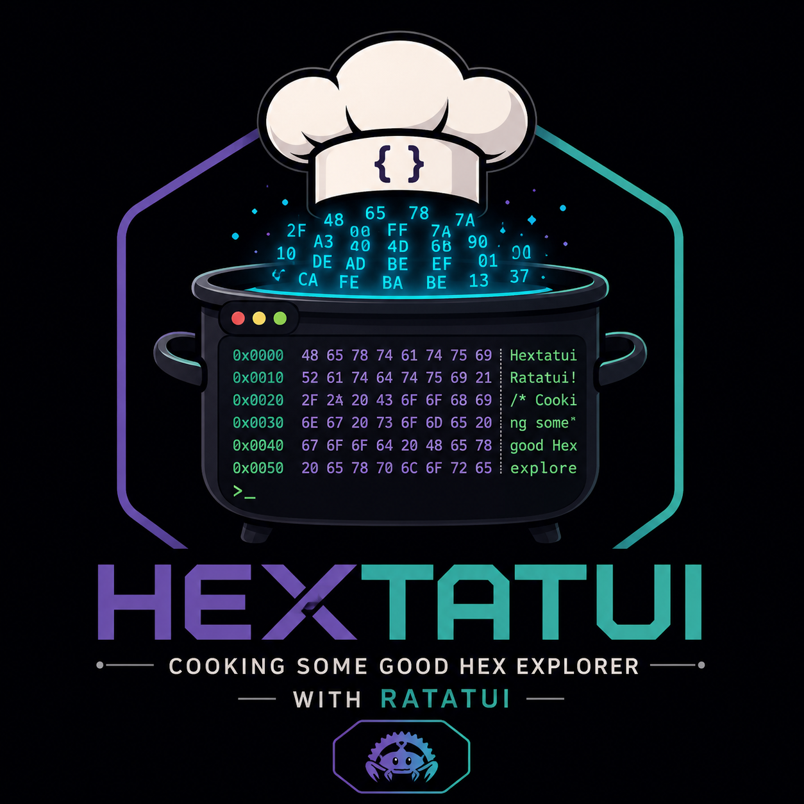

# Hextatui — Cooking some good Hex explorer with Ratatui

> **Rust + Ratatui + way too many CPU threads.**
> **Point it at a binary. Let it cook.**

<p align="center">
  
</p>

A fast, interactive terminal-based hex and binary explorer written in Rust, powered by **Ratatui**.

Scan large binaries, search strings, navigate offsets, inspect surrounding bytes, and explore binary data without drowning in terminal output.

---

## What is Hextatui?

Hextatui is a `strings` + hex viewer that doesn't make you choose. It parallel-scans a binary with Rayon, streams results into a paged Ratatui TUI, and lets you walk every discovered string with its **exact binary position**.

No GUI. No 500 MB hex editor. Just a terminal, 24 threads cooking in the background, and a calm paginated table up front.

```
hextatui game.utoc --threads 24 --interactive
```

```
File: game.utoc
Size: 184.7 MB
Found: 1,284 strings

---------------------------------------------------------------------------
#     Offset       Position              Length   String
---------------------------------------------------------------------------
1     0x001A42F0   1,721,072 / 193,671,168    31   Engine/Source/Runtime/Core
2     0x001A44B8   1,721,528 / 193,671,168     5   FName
3     0x00482C10   4,727,824 / 193,671,168    11   MoviePlayer
---------------------------------------------------------------------------
```

---

## Features

- **Interactive TUI** — paged, virtualized table (Ratatui 0.29 + Crossterm). Never floods your terminal.
- **Background scan** — Rayon workers abuse all your cores while the UI stays responsive. Progress bar included.
- **Position as first-class field** — every hit shows `Offset (hex)`, `Decimal`, `Position (decimal/total)` and `%` through the file. Jump straight to the byte you care about.
- **Hex inspector** — `Enter` on any string shows surrounding bytes with hex + ASCII, caret at string start, and file percentage.
- **Search & navigate** — next/prev page, goto offset/page, filter strings live, select with `↑↓`.
- **Export** — `--output results.txt` dumps the full sorted table (offset, position, length, encoding, string).
- **Chunked, not greedy** — streams `4 KiB` chunks per `64 MiB` region. No need to load a 2 GB `.pak` into RAM.
- **Deterministic** — parallel results are sorted by offset before display.

Useful for `.pak`, `.utoc`, `.ucas`, ELF/PRX, shader blobs, audio containers, and any opaque binary.

Current string engine extracts printable ASCII (space + `0x21..0x7E`). UTF-16/regex/entropy are natural extensions.

## Install

### Build from source

```powershell
cargo build --release
.\target\release\hextatui.exe --help
```

Requires Rust 1.85+ (edition 2024).

### Run without install

```powershell
cargo run -- game.utoc --threads 24 --interactive
```

## Usage

### Interactive (the fun part)

```powershell
# The recipe from the spec
hextatui game.utoc --threads 24 --interactive

# Control the table
hextatui game.utoc --threads 24 --interactive --page-size 50

# Also save the full scan
hextatui game.utoc --threads 24 --interactive --output results.txt
```

Background scan starts immediately:

```
┌─ Hextatui ────────────────────────────────────────────────────────────────┐
│ game.utoc   184.7 MiB   Threads: 24                                      │
├───────────────────────────────────────────────────────────────────────────┤
│ Scan progress: ███████████████░░░░░░░░░░░ 52%                            │
│ Found: 1,284                                                            │
├───────┬──────────────┬──────────┬──────────┬───────────────────────────────┤
│ #     │ Offset       │ Position │ Length   │ String                       │
├───────┼──────────────┼──────────┼──────────┼───────────────────────────────┤
│ 1042  │ 0x001A42F0   │ 0.89%    │ 31       │ Engine/Source/Runtime/Core  │
│ 1043  │ 0x001A44B8   │ 0.89%    │ 5        │ FName                        │
├───────────────────────────────────────────────────────────────────────────┤
│ Page 21 / 26                         Selected: #1042                     │
├───────────────────────────────────────────────────────────────────────────┤
│ [→] Next  [←] Prev  [↑↓] Select  [Enter] Inspect  [F] Filter  [Q] Quit│
└───────────────────────────────────────────────────────────────────────────┘
```

Press `Enter`:

```
┌─ String Inspection ───────────────────────────────────────────────────────┐
│ Engine/Source/Runtime/Core                                                │
│ Offset:     0x001A42F0  Decimal: 1,721,072  Position: 0.89%  Length: 31   │
├────────────────────────────────────────────────────────────────────────────┤
│ 0x001A42D0  00 00 00 00 45 6E 67 69 6E 65 2F 53 6F 75 72 63 │ ....Engine/Sourc│
│ 0x001A42E0  65 2F 52 75 6E 74 69 6D 65 2F 43 6F 72 65 00 00 │ e/Runtime/Core..│
│                         ^                                                  │
│                         └── 0x001A42F0                                     │
├────────────────────────────────────────────────────────────────────────────┤
│ [←] Previous result  [→] Next result  [Esc] Back                          │
└────────────────────────────────────────────────────────────────────────────┘
```

### All data (no filter) — default

No flag = **all data**: hex + ASCII + strings interleaved. You don't need `--strings`.

```powershell
hextatui game.utoc                      # hex + strings (default, position-aware)
hextatui game.utoc --hex                # only hex+ASCII — raw dump of every byte (alias: --hex-only)
hextatui game.utoc --strings            # only strings (alias: --strings-only)
hextatui game.utoc --json --strings     # only JSON structures
```

### Non-interactive + Range

Dump exactly a byte window `[START, END)` — exclusive `END` — hex or decimal:

```powershell
hextatui game.utoc --hex
hextatui game.utoc --range 0x28100 0x28350 --hex
hextatui game.utoc --range 0x28200 0x28220 --hex          # 0x20 bytes: 0x28200..0x2821F
hextatui game.utoc --range 164096 164688 --hex
hextatui game.utoc --range 0x28100 0x28350 --strings
hextatui game.utoc --range 0x281D0 0x28280 --hex           # precise reproducible window

# legacy aliases:
hextatui game.utoc --start-offset 0x28100 --end-offset 0x28350 --hex
```

Still streams with `--threads`/`--chunk`:

```powershell
hextatui game.pak
hextatui game.pak --threads 24
hextatui game.utoc --threads 24 --strings-only
hextatui C:\path\to\game --threads 24
hextatui game.elf --threads 24 --chunk 4096 --min-string 5
hextatui game.utoc --threads 24 --output results.txt
hextatui game.utoc --range 0x28100 0x28350 --output results.txt
```

Output line format:

```
[STRING 0x001A42F0 dec=1721072 pos=1721072/193671168 (0.89%) len=31] Engine/Source/Runtime/Core
```

And `results.txt`:

```
# | Offset     | Decimal      | Position              | %      | Length | Encoding | String
  1 | 0x001A42F0 |    1,721,072 |    1,721,072 / 193,671,168 |   0.89% |     31 |    ASCII | Engine/Source/Runtime/Core
```

## Keybindings (Interactive)

| Key | Action |
|---|---|
| `→` / `PageDown` | Next page |
| `←` / `PageUp` | Previous page |
| `↑` `↓` / `j` `k` | Select prev/next result |
| `←` `→` (in hex view) | Prev/next result while inspecting |
| `G` | Goto — type `0x001A42F0`, decimal offset, or page `#` |
| `F` or `/` | Filter/search strings (live, case-insensitive) |
| `H` or `Enter` | Hex inspector around selected result |
| `Esc` | Back / cancel filter/goto |
| `Q` | Quit — also writes `--output` if set |

Also: `Home`/`End` to first/last result.

Flags:

```
--threads 24                    # 0 = Rayon default
--page-size 50                  # rows per page in TUI (capped by viewport)
--output results.txt
--chunk 4096                    # read size inside each region
--region 67108864               # 64 MiB per worker
--min-string 4
--strings-only / --strings      # only strings
--hex-only / --hex               # only hex+ASCII (all data, no strings)
--json                          # only valid JSON objects/arrays
--range <START> <END>           # exact window [START,END) hex 0x... or decimal
--start-offset <OFF> --end-offset <OFF>  # same as --range
# no flag = all data (hex + strings interleaved)
```

## Architecture

```
 CLI / Args ──► Scanner Workers (Rayon, chunked 4 KiB) ──► mpsc channel ──► Result Store ──► Ratatui
                24 threads, 64 MiB regions,              sorted by offset   page/filter/hex
                4096 byte overlap for boundary strings
```

Scanning never blocks the UI. Results arrive sorted; overlapping region duplicates and boundary fragments are deduped.

Hex inspector reads `±64` bytes around the selected offset on demand (aligned to 16-byte boundary).

## Tech

- **Rust 1.85**, edition 2024
- **Ratatui 0.29** + **Crossterm 0.28** for the TUI
- **Rayon 1.10** for parallel regions
- **Clap 4.5** for args

Single binary, `cargo build --release` and go.

## Why not ImHex / 010?

ImHex and 010 Editor are fantastic full hex editors. Hextatui is the opposite: a deliberately small `scan → paginate → inspect` viewer for the exact workflow `strings → offset → surrounding bytes` with `→`/`←` paging muscle memory. It sits on top of the scanning core, so adding `--regex`, `--utf16`, `--entropy`, `--hex-pattern` later doesn't require redesigning the UI.

---

*Hextatui is a research/inspection tool, not a format parser. It does not decode UTOC/PAK structure — it shows you where the strings are so you can.*
